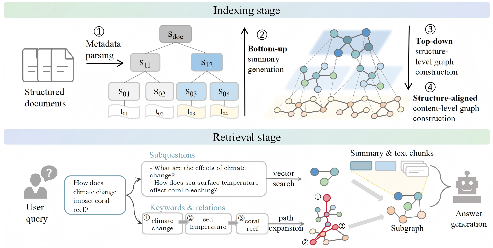

<div align="center">

# ASTRA: Adaptive Structure and Topic-aware Retrieval-Augmented Generation
[](https://huggingface.co/datasets/TommyChien/UltraDomain)
[](./LICENSE)

</div>

## Framework
ASTRA performs bottom-up summarization and top-down entity extraction to construct a hierarchical graph representation of the document:



## Installation

```bash
cd ASTRA
pip install -e .
```

## Quick Start

```python
from astra import ASTRA, QueryParam

graph_func = ASTRA(
    working_dir="./your_work_dir",
    enable_llm_cache=True,
    embedding_batch_num=6,
    embedding_func_max_async=8,
    )
# indexing
with open("path_to_your_context", "r") as f:
    graph_func.insert(f.read())
# retrieval & generation
print("Perform dual search:")
print(graph_func.query("The question you want to ask?", param=QueryParam(mode="dual")))
```

The entry scripts read documents from the repository `./files/` directory. Pass only the file name when running them, for example:

```shell
python astra_search_openai.py your_context.json
```


## Configuration

You can configure model endpoints and runtime options in `./config.yaml`:

- LLM provider settings (`openai`, `deepseek`, `glm`)
- Embedding model settings
- Retrieval and token-budget controls
- Working directory behavior

For third-party APIs, set API key, model name, and base URL in the corresponding section.


## Project Layout

- `astra/`: core library implementation.
- `pageindex/`: utilities for processing raw files into hierarchy representation.
- `files/`: example input documents of the computer science category from the Ultradomain dataset.

## Acknowledgement
This work is powered by these open-source projects:
- [HiRAG](https://github.com/hhy-huang/HiRAG): We build upon its graph construction and RAG pipeline.
- [PageIndex](https://github.com/VectifyAI/PageIndex): We use its modified version for document processing and hierarchical graph construction.


